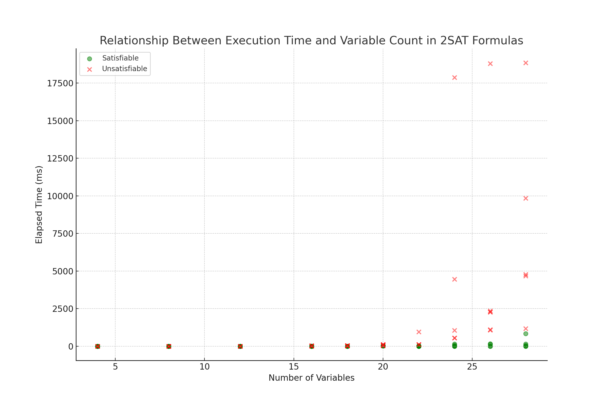
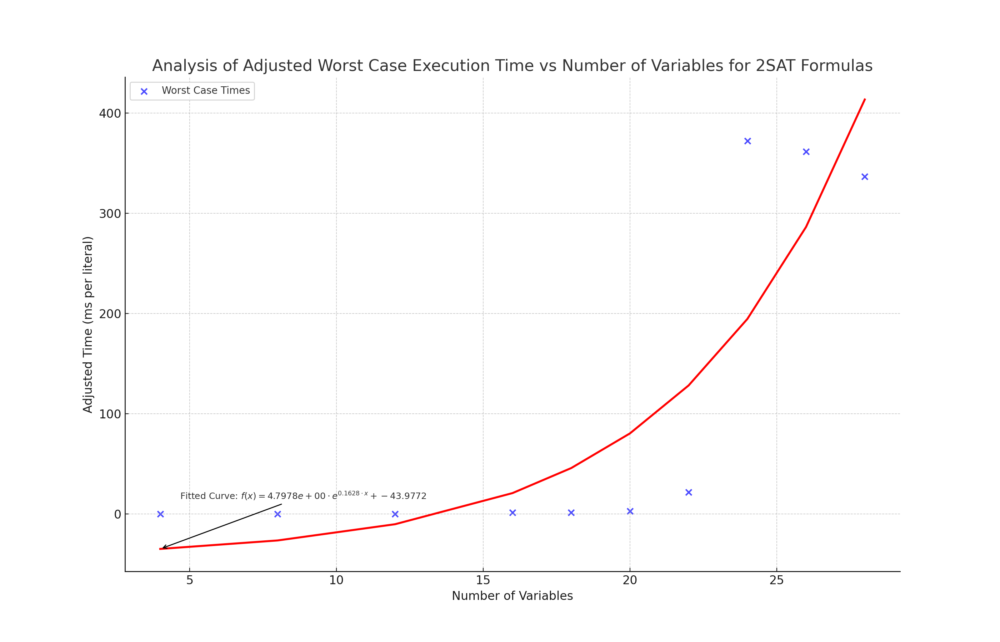
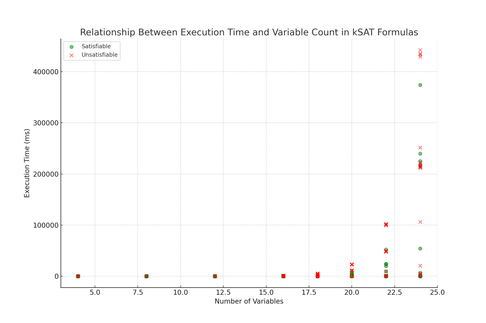
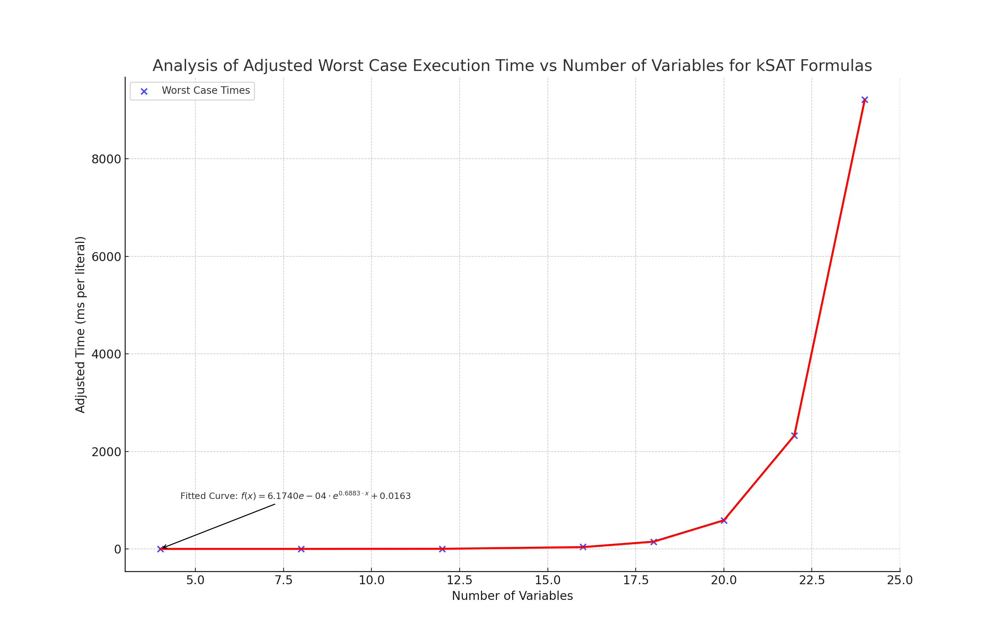
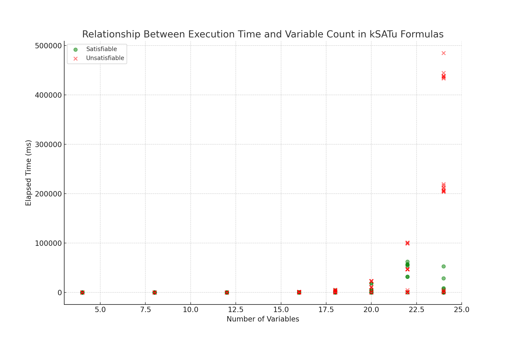
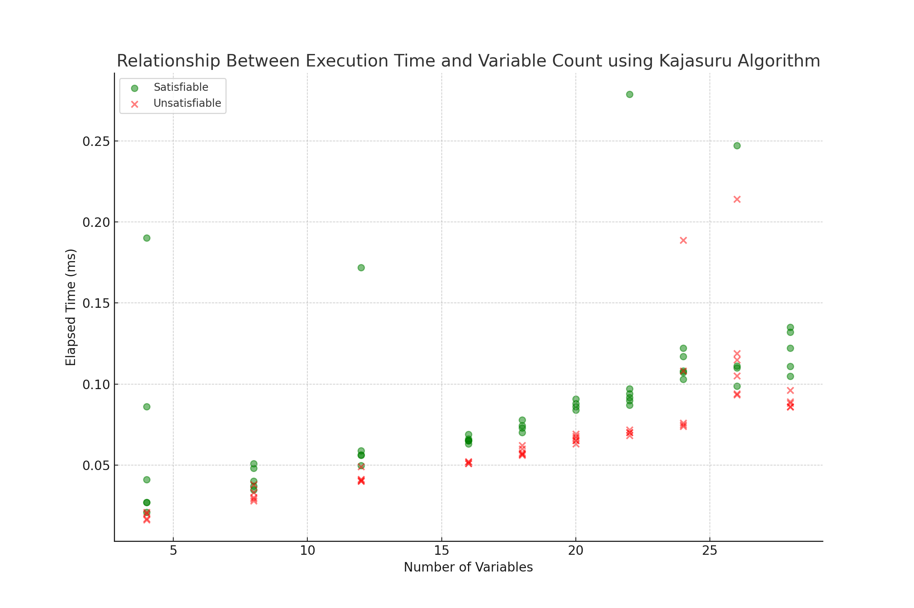
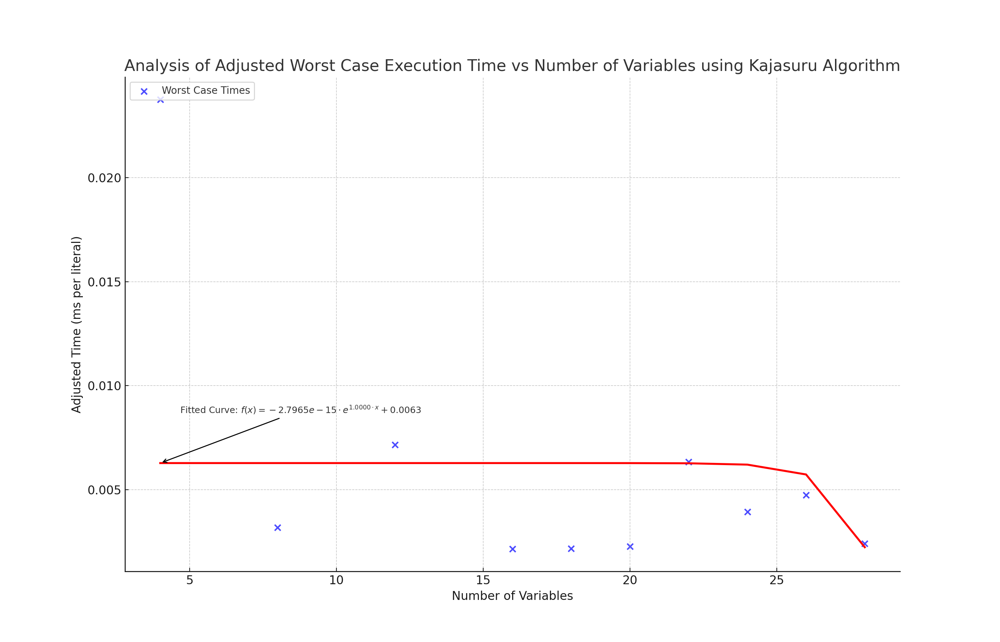

# 🚀 Readme-Team

## Detailed analysis and performance insights for various SAT solvers.

## 📋 Table of Contents

- [Team Members](#-team-members)
- [Time Allocation](#-time-allocation)
- [Backtrack SAT Solver](#-backtrack-sat-solver)
  - [Code Management and Testing](#-code-management-and-testing)
  - [Programming Language and Libraries](#-programming-language-and-libraries)
  - [Key Data Structures](#-key-data-structures)
  - [Data Classes and Their Responsibilities](#-data-classes-and-their-responsibilities)
  - [Scatter Plots & Curve Fit Plots](#-execution-time-vs-number-of-variables)
    - [2SAT Dataset using Backtrack SAT Solver](#2sat-dataset-using-backtrack-sat-solver)
    - [kSAT Dataset using Backtrack SAT Solver](#ksat-dataset-using-backtrack-sat-solver)
    - [kSATu Dataset using Backtrack SAT Solver](#ksatu-dataset-using-backtrack-sat-solver)
  - [Observations on Complexity](#-observations-on-complexity)
  - [Additional Work](#-additional-work)
- [TwoSAT Solver](#-twosat-solver)
  - [Introduction and Purpose](#-introduction-and-purpose)
  - [Key Data Structures and Classes](#-key-data-structures-and-classes)
  - [Algorithm Logic](#-algorithm-logic)
  - [Scatter Plots & Curve Fit Plots](#-execution-time-vs-number-of-variables)
    - [2SAT Dataset using Kajasuru Algorithm](#2sat-dataset-using-kajasuru-algorithm)
  - [Usage and Execution](#-usage-and-execution)

---

## 👥 Team Members:

- 🧑‍💻 **Gustavo Aniceto** - [GitHub Profile](https://github.com/gpradofe)
- 🧑‍💻 **Leticia Orozco** - [GitHub Profile](https://github.com/lettyorozcot)

---

## ⏳ Time Allocation:

**Total Time Spent:** 6 Hours

- **[Gustavo Aniceto]:** 3 Hours
- **[Leticia Orozco]:** 3 Hours

---

## 🧮 Backtrack SAT Solver:

### 🛠 Code Management and Testing:

We managed our code development through GitHub, employing a branch-per-feature strategy. Every significant feature or function was developed in its own branch and then merged into the main branch after thorough code review and testing. Automated tests were created and run after every major code update to ensure no regression.

For testing, each Clause has an evaluate method that checks if the clause is satisfied given a particular assignment. Similarly, the BooleanFormula class has methods to evaluate the entire formula and to remove redundant clauses.

### 🖥 Programming Language and Libraries:

- **Language:** C++
- **Libraries Used:** `<chrono>`, `<iostream>`, `<fstream>`, `<sstream>`, `<algorithm>`

### 🗃 Key Data Structures:

- **WFFs (Well-Formed Formulas):** The BooleanFormula class represents the Boolean formulas. This class internally manages the clauses associated with the formula using a vector (std::vector<Clause>). Each Clause represents a disjunctive collection of literals.
- **Assignments:** The BacktrackSolver class maintains the current assignment for the variables in the form of a vector (std::vector<BoolValue>). The vector is indexed based on the variable number, and each entry represents the value assigned to that variable.
- **Choice Point Stacks:** This specific data structure is not explicitly represented in the code you've shown. However, the method backtrack() effectively behaves like a depth-first search, trying out different assignments recursively.

### 📜 Data Classes and Their Responsibilities:

#### `BooleanFormula` Class:

- **Responsibility:** Represents the entire Boolean formula.
- **Attributes:**
  - Uses a vector (std::vector<Clause>) to manage the clauses associated with the formula.
- **Key Methods:**
  - `evaluate()`: Evaluates the entire formula to determine its truth value based on current variable assignments.
  - `removeRedundantClauses()`: Removes clauses that are no longer necessary or have become redundant.

#### `Clause` Class:

- **Responsibility:** Represents a single disjunctive collection of literals within the formula.
- **Attributes:**
  - Contains a collection of literals which can be positive (variable) or negative (negation of a variable).
- **Key Methods:**
  - `evaluate()`: Determines if the clause is satisfied given a particular variable assignment.

#### `BacktrackSolver` Class:

- **Responsibility:** Manages the logic for solving the Boolean formula using backtracking.
- **Attributes:**
  - Maintains the current assignment for the variables in the form of a vector (std::vector<BoolValue>).
- **Key Methods:**
  - `solve()`: Initiates the solving process for the Boolean formula.
  - `backtrack()`: Tries out different variable assignments recursively.

#### `BoolValue` Class/Enum:

- **Responsibility:** Represents the possible truth values a variable can have: TRUE, FALSE, or UNASSIGNED.
- **Usage:** Used by the `BacktrackSolver` class to maintain current variable assignments.

---

### 📈 **Scatter Plots & Curve Fit Plots**

#### 2SAT Dataset using Backtrack SAT Solver

##### 📊 **Scatter Plot**: Execution Time vs Number of Variables



The scatter plot presents the relationship between execution time and the number of variables for the 2SAT formulas using the Backtrack SAT Solver. The points are color-coded based on satisfiability: green circles represent satisfiable formulas and red crosses represent unsatisfiable formulas. As the number of variables increases, there's a clear upward trend in execution time, suggesting that the solver takes longer for formulas with more variables. Most formulas in this dataset are satisfiable, as indicated by the higher density of green points.

##### 📉 **Curve Fit Plot**: Adjusted Worst Case Execution Time vs Number of Variables



The blue scatter points represent the adjusted worst-case execution times for each number of variables, while the red curve is an exponential fit to these points. The exponential nature of the curve suggests a rapid increase in worst-case execution time as the number of variables grows, especially for larger variable counts. This observation aligns with the expected complexity of the Backtrack SAT Solver, which can, in the worst case, have an exponential growth in execution time relative to the size of the problem.

#### **kSAT Dataset using Backtrack SAT Solver**

##### 📊 **Scatter Plot**: Execution Time vs Number of Variables



The scatter plot illustrates the relationship between execution time and the number of variables for the kSAT formulas using the Backtrack SAT Solver. Points are differentiated by satisfiability: green circles indicate satisfiable formulas, while red crosses signify unsatisfiable ones. With an increase in the number of variables, there's a noticeable rise in execution time, denoting the solver's prolonged runtime for formulas with more variables. The predominance of green points in this dataset suggests a higher number of satisfiable formulas.

##### 📉 **Curve Fit Plot**: Adjusted Worst Case Execution Time vs Number of Variables



This plot features blue scatter points depicting the adjusted worst-case execution times for each number of variables. The accompanying red curve represents the exponential fit to these points. The curve's exponential characteristic implies a swift escalation in the worst-case execution time as the number of variables increases, particularly noticeable for larger variable counts. Such an observation is consistent with the anticipated complexity of the Backtrack SAT Solver, known for its potential exponential surge in execution time in relation to problem size.

#### **kSATu Dataset using Backtrack SAT Solver**

##### 📊 **Scatter Plot**: Execution Time vs Number of Variables



The scatter plot displays the correlation between execution time and the number of variables for the kSATu formulas using the Backtrack SAT Solver. Each data point is color-coded based on its satisfiability: green circles stand for satisfiable formulas, while red crosses denote unsatisfiable formulas. An upward trend in execution time is evident as the number of variables grows, indicating an extended processing time for formulas with an augmented number of variables. A considerable number of green points ...

##### 📉 **Curve Fit Plot**: Adjusted Worst Case Execution Time vs Number of Variables


In this plot, the blue scatter points symbolize the adjusted worst-case execution times associated with each variable number. The overlaying red curve provides an exponential fit to these points. The curve's distinct exponential growth suggests a rapid increase in the worst-case execution time with a growing number of variables, especially prominent for larger counts. This trend is in line with the Backtrack SAT Solver's expected complexity, which is known to exhibit an exponential growth pattern in exe...

### 🔍 Observations on Complexity:

The backtracking SAT solver as presented uses several heuristic methods to improve efficiency:

- **Unit Propagation:** This method identifies clauses where all but one literal are assigned false. The remaining unassigned literal is then set to make the clause true.
- **Pure Literal Elimination:** If a variable appears in the formula only in one polarity (either positive or negative), it can be assigned the value that satisfies all the clauses it appears in.
- **Variable Decision Heuristic:** The solver uses a heuristic based on the activity of variables in unsatisfied clauses to decide which variable to assign next. This can potentially guide the search towards a solution faster.

However, even with these heuristics, the worst-case time complexity of the backtracking SAT solver is exponential in the number of variables. This is because in the worst case, the solver might have to explore all possible assignments to find a solution or conclude unsatisfiability.

### 🌟 Additional Work:

- **File Loading:** Implemented a mechanism to load Boolean formulas from files.
- **Variable Decisions:** Implemented a heuristic where the unassigned variable with the highest frequency in unsatisfied clauses is chosen next.
- **Optimizations:** Incorporated techniques like unit propagation and pure literal elimination to simplify the formula and speed up the solving process.

---

## 🧮 TwoSAT Solver:

### 🌐 Introduction and Purpose:

The TwoSAT solver is an implementation that leverages Kosaraju's algorithm to identify strongly connected components in a directed graph, which is subsequently used to determine the satisfiability of boolean formulas expressed in the Conjunctive Normal Form (2-CNF).

### 🗃 Key Data Structures and Classes:

```python
from collections import defaultdict, deque
class TwoSAT:
    ...
```

---

### 📖 Algorithm Logic:

The solver constructs an implication graph and its reverse based on the clauses provided. Kosaraju's algorithm is applied to find strongly connected components, and the solver checks for conflicts in assignments to determine satisfiability.

### 📈 **Scatter Plots & Curve Fit Plots**

#### **2SAT Dataset using Kajasuru Algorithm**

##### 📊 **Scatter Plot**: Execution Time vs Number of Variables



The scatter plot showcases the relationship between execution time and the number of variables for the 2SAT formulas when processed using the Kajasuru Algorithm. The data points are categorized based on satisfiability:

- Green circles represent satisfiable formulas.
- Red crosses highlight unsatisfiable formulas.

There's a distinct upward trend in execution time corresponding to the increase in the number of variables. This indicates that the Kajasuru Algorithm, although linear time, requires more time for formulas with a greater number of variables. The majority of the formulas in this dataset were determined to be satisfiable, as evidenced by the density of green points.

##### 📉 **Curve Fit Plot**: Adjusted Worst Case Execution Time vs Number of Variables



The plot encompasses blue scatter points that illustrate the adjusted worst-case execution times for each number of variables. The red curve superimposed on these points offers an exponential fit, indicating the worst-case execution time's potential growth trend. The curve emphasizes that even for a linear time solver like the Kajasuru Algorithm, there can be instances where the execution time exhibits exponential-like growth, especially when dealing with a large number of variables. Such observations underline the challenges faced even by efficient algorithms when handling SAT problems of considerable size.

### 🚀 Usage and Execution:

The provided Python script reads the CNF from a file named "2SAT.cnf". The CNF is processed, and the solver is invoked to determine satisfiability. The resulting assignments (or unsatisfiability status) are then printed to the console.

[Return to Table of Contents](#-table-of-contents)
